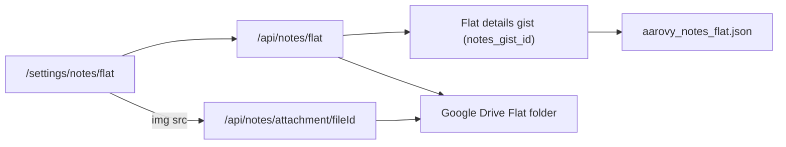

# AAROVY Billing

Next.js web app for managing monthly electricity and rent bills for AAROVY flats (G, 1, 3–7). Authenticated users create bills from meter readings, view/edit them, download PDF invoices, and keep per-tenant notes with photo/PDF attachments.

Stack: **Next.js 15 (App Router)** · **React 19** · **Clerk** · **GitHub Gists** · **Google Drive (OAuth)** · **pdfmake** · **Tailwind / shadcn**

---

## Flows

### Auth

1. All routes except `/signin` are protected by Clerk middleware (`middleware.ts`).
2. Unauthenticated users are redirected to `/signin`.
3. Signed-in users land on `/bills` (`/` redirects permanently to `/bills`).

### List bills

1. `/bills` loads the current month’s bills via `GET /api/bills?year=&month=`.
2. Calendar control lets you pick another month/year, or reset to the current month.
3. Each row links to `/bills/{year}_{month}_{flat}` to view details.

### Create bill

1. `/bills/new` opens a form for a flat + billing period.
2. Shared billing context (month, year, recorded date, common meter, main meter) is cached in `localStorage` (`billingContext`) so successive flats for the same cycle share inputs.
3. Choosing a flat loads guest name and rent from flat details (`GET /api/flats`).
4. Previous month’s bill for that flat supplies opening units (flat + common).
5. Derived fields are computed client-side:
   - `usedUnit` = closing − opening
   - `commonUsedUnit` = (common close − common open) ÷ tenants
   - `chargeableUnit` = used + common used
   - `ratePerUnit` = main meter billed ÷ main meter consumed
   - `subTotal` = chargeable × rate
   - `grandTotal` = subtotal + misc + maintenance + parking + rent + arrears + adjustment
6. Save posts the bill to `POST /api/bills` (upsert by flat + year + month).

### View / edit / PDF

1. `/bills/[id]` shows the bill (from React context cache or `GET /api/bills/[id]`).
2. Edit at `/bills/[id]/edit` with the same calculation logic; save again via `POST /api/bills`.
3. PDF download uses pdfmake (`PdfBill`) with the AAROVY invoice layout.

### Settings

1. `/settings` loads and edits per-flat guest name and rent.
2. Changes are persisted with `POST /api/flats`.
3. Each flat card has a **Notes** button → `/settings/notes/[flat]`.

### Tenant notes

1. `/settings/notes/[flat]` lists notes for a flat (newest first).
2. Each note has text, a date, and an optional single photo/PDF attachment.
3. Add / edit / delete notes via `/api/notes/[flat]` (`POST` / `PATCH` / `DELETE`).
4. Attachments upload to **Google Drive** (one file per note; images or PDFs, max 8 MB).
5. Image previews load through a Clerk-protected proxy (`/api/notes/attachment/[fileId]`); the attachment button opens the file in Google Drive.

```
Browser → Next.js API routes → GitHub Gist API (bills, flats, notes)
                │              → Google Drive API (note attachments)
                ↑
             Clerk auth
```

---

## Data storage

There is **no traditional database**. Structured data lives in **private GitHub Gists**, accessed server-side with a personal access token. Note attachments (binary files) live in **Google Drive**.

| Store | Env vars | Purpose |
| --- | --- | --- |
| **Index gist** | `INDEX_GIST_ID`, `INDEX_FILE_NAME` | Map `"{year}_{month}"` → monthly bills gist ID |
| **Monthly bill gists** | Created on demand | One private gist per month: `aarovy_bills_{year}_{month}.json` (JSON array of bills) |
| **Flat details gist** | `FLAT_DETAILS_GIST_ID`, `FLAT_DETAILS_FILE_NAME` | Guest name, rent, and `notes_gist_id` per flat |
| **Per-flat notes gists** | Created on demand; id stored on the flat | One private gist per flat: `aarovy_notes_{flat}.json` (JSON array of notes) |
| **Google Drive folder** | `GOOGLE_DRIVE_NOTES_FOLDER_ID` | Note attachments, organized into `Flat {flat}/` subfolders |

Additional client-side storage:

- **`localStorage`** — short-lived billing context while creating multiple bills in one session
- **React context (`AppCtx`)** — in-memory cache of the last viewed/edited bill for navigation

Gist helpers live in `lib/github_gist_utils.ts`; Drive helpers in `lib/google_drive_utils.ts`. API routes:

| Method | Path | Behavior |
| --- | --- | --- |
| `GET` | `/api/bills?year=&month=` | List (or create empty) monthly bills |
| `POST` | `/api/bills` | Create or update a bill in that month’s gist |
| `GET` | `/api/bills/[id]` | Fetch one bill; `id` = `{year}_{month}_{flat}` |
| `GET` / `POST` | `/api/flats` | Read / replace flat details |
| `GET` / `POST` / `PATCH` / `DELETE` | `/api/notes/[flat]` | List / add / edit / delete notes (multipart when a file is attached) |
| `GET` | `/api/notes/attachment/[fileId]` | Stream a Drive attachment (auth-gated preview/download) |

### Notes storage flow

Notes are keyed by flat. The per-flat notes gist is created lazily on first access, and its id is written back onto that flat in the flat-details gist.



---

## Data modelling

### Bill (`BillType`)

Identity for a bill is the composite key **`year` + `month` + `flat`** (also used as the URL id).

| Field | Role |
| --- | --- |
| `recordedOn`, `guestName`, `month`, `year`, `flat` | Metadata |
| `openingUnit`, `closingUnit`, `usedUnit` | Flat meter |
| `commonOpenUnit`, `commonCloseUnit`, `commonTenants`, `commonUsedUnit` | Shared/common meter share |
| `chargeableUnit`, `mainMeterBilled`, `mainMeterConsumedUnit`, `ratePerUnit`, `subTotal` | Electricity charge |
| `otherMiscCharges`, `societyMaintenanceCharges`, `parkingCharges`, `houseRent` | Fixed / other charges |
| `arrears`, `arrearsDescription`, `adjustment`, `adjustmentDescription` | Adjustments |
| `grandTotal` | Final amount |

Numeric values are stored as **strings** in the JSON (form-friendly); calculations parse them as floats.

### Flat details (`FlatDetailsType`)

```json
{
  "G": { "rent": 0, "guest_name": "...", "notes_gist_id": "..." },
  "1": { "rent": 0, "guest_name": "..." }
}
```

`notes_gist_id` is optional and set automatically the first time notes are opened for that flat. Configured flat codes: `G`, `1`, `3`, `4`, `5`, `6`, `7` (`lib/config.ts`).

### Note (`NoteType`)

```ts
{
  id: string;                  // crypto.randomUUID()
  text: string;
  date: string;                // dd/mm/yyyy
  attachmentName?: string;     // original filename
  attachmentId?: string;       // Google Drive file id
  attachmentMimeType?: string; // image/* or application/pdf
  createdAt: string;           // ISO
  updatedAt: string;           // ISO
}
```

Stored as a JSON array in the per-flat notes gist. At most one attachment per note; editing with a new file replaces the previous Drive file.

### Index gist

```json
{
  "2026_7": "<gist-id-for-july-2026>",
  "2026_6": "<gist-id-for-june-2026>"
}
```

### Cache wrapper (`CacheType<T>`)

```ts
{ data: T; expiresAt: number; createdAt: number }
```

Used for the client `billingContext` in `localStorage`.

---

## Deployment

Designed for **[Vercel](https://vercel.com)** (Next.js App Router + `.vercel` in `.gitignore`).

### Environment variables

Set these in the Vercel project (and locally in `.env.local`):

| Variable | Description |
| --- | --- |
| `GITHUB_ACCESS_TOKEN` | GitHub token with gist read/write |
| `INDEX_GIST_ID` | Gist ID for the month → gist index |
| `INDEX_FILE_NAME` | Filename inside the index gist |
| `FLAT_DETAILS_GIST_ID` | Gist ID for flat details |
| `FLAT_DETAILS_FILE_NAME` | Filename inside the flat-details gist |
| `NEXT_PUBLIC_CLERK_PUBLISHABLE_KEY` | Clerk publishable key |
| `CLERK_SECRET_KEY` | Clerk secret key |
| `NEXT_PUBLIC_CLERK_SIGN_IN_URL` | Typically `/signin` (as configured in Clerk) |
| `GOOGLE_OAUTH_CLIENT_ID` | Google OAuth 2.0 client ID (Drive access) |
| `GOOGLE_OAUTH_CLIENT_SECRET` | Google OAuth 2.0 client secret |
| `GOOGLE_OAUTH_REFRESH_TOKEN` | Long-lived refresh token from `npm run drive:auth` |
| `GOOGLE_DRIVE_NOTES_FOLDER_ID` | Drive folder id where note attachments are stored |

### Google Drive setup (note attachments)

Attachments use **OAuth with a refresh token** (not a service account — service accounts have no personal Drive storage quota). Uploads land in a folder owned by the authenticating Google user.

1. In Google Cloud Console, enable the **Google Drive API**.
2. Create an **OAuth 2.0 Client** (Desktop app) and note the client id/secret.
3. Create (or pick) a Drive folder for notes and copy its id into `GOOGLE_DRIVE_NOTES_FOLDER_ID`.
4. Run the one-time helper to mint a refresh token:

```bash
npm run drive:auth
```

Follow the printed URL, authorize, and copy the resulting `GOOGLE_OAUTH_*` values into `.env.local` / Vercel. This is a **one-time** step; you don't need to re-run it after deploys.

### Deploy steps

1. Push to GitHub (`abhisekpadhi/aarovy_billing_webapp_next`).
2. Import the repo in Vercel (or link an existing project).
3. Add the env vars above (including the Google Drive/OAuth values).
4. Create the index and flat-details gists once in GitHub; point env vars at them.
5. Deploy — Vercel runs `next build` / `next start` on their serverless platform.

> Handy: `scripts/pull-env.sh` pulls env vars from the linked Vercel project into a local `.env` file.

The app also ships a **web app manifest** (`app/manifest.ts`) and security headers (`next.config.ts`) for standalone / PWA-style install.

---

## Local development

```bash
npm install
# Add .env.local with the variables listed above
npm run dev   # http://localhost:3001 (Turbopack)
```

```bash
npm run build
npm start
```

### Project layout

```
app/
  bills/                 # List, create, view, edit
  settings/              # Flat guest/rent config
  settings/notes/[flat]/ # Per-tenant notes
  signin/                # Clerk sign-in
  api/bills|flats        # Gist-backed API
  api/notes/             # Notes CRUD + attachment proxy
components/
  ui/                    # shadcn primitives (rounded buttons, dialog, ...)
  custom/                # ExpandingTextarea, PdfBill, selectors
lib/                     # models, gist utils, google_drive_utils, config, API helpers
scripts/                 # drive-oauth-setup.mjs, pull-env.sh
middleware.ts            # Clerk route protection (/bills, /settings, /api/...)
```
